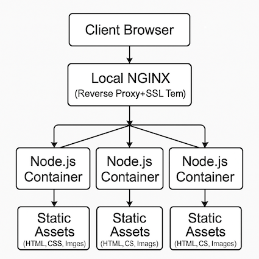

## NGINX Reverse Proxy Setup
Guide to configuring and securing an NGINX reverse proxy for web applications

## Table of Contents
- [Project Objective](#project-objective)
- [Steps Covered](#steps-covered)
- [File Overview](#file-overview)
- [Project Structure](#project-structure)
- [Setup](#setup)
- [Notes](#notes)
- [Author](#author)

## Project Objective
To setup a local development environment using Docker containers for a Node.js web application, served through an NGINX reverse proxy.

## Architecture Overview
.
- This diagram shows how HTTPS traffic flows from the client browser to NGINX, which acts as a reverse proxy and handles SSL termination. NGINX distributes requests across three Node.js containers running the Express.js web app.

## Steps Covered
- Dockerise a Node.js application
    Containerise the web application using Docker for consistent and portable deployment.
- Run Multiple Web Servers
    Launch three instances of the Node.js application as separate Docker containers to simulate horizontal scaling.
- Setup NGINX as a Reverse Proxy
    Install and configure NGINX to act as a reverse proxy, distributing incoming traffic across to the three application Instances for load balancing.
- Enable HTTPS with SSL/TLS
    Secure the application by enabling HTTPS. Configure NGINX with a server-side TLS certificate to encrypt traffic between clients and the proxy.

## File Overview

| Path | Description |
|------|-------------|
| `app/` | Node.js source code, static assets, and Dockerfile |
| `config/nginx.conf` | NGINX reverse proxy configuration |
| `ssl/` | SSL certificates (private key excluded from repo) |
| `assets/` | Diagrams and visuals |
| `docker-compose.yaml` | Orchestration file for multi-container setup |
| `README.md` | Project documentation |

## Project Structure
```text
.
├── app
│   ├── Dockerfile
│   ├── images
│   │   ├── career-quiz.png
│   │   ├── devops.png
│   │   ├── devsecops.png
│   │   └── it-beginners.png
│   ├── index.html
│   ├── package-lock.json
│   ├── package.json
│   └── server.js
├── assets
├── config
│   └── nginx.conf
├── docker-compose.yaml
├── README.md
└── ssl
```
## Setup

- Prepare your web application source code like the index.html, server.js.
    See the full [index.html](./app/index.html), [server.js](./app/server.js).

- Install dependencies
```bash
npm install
```
- Start the application - 
```bash 
node server.js
```
- Write Dockerfile.
    See the full [Dockerfile](./app/Dockerfile).

- Build Image based on the the Dockerfile - 
```bash
docker build -t myapp:1.0
```
- Write docker-compose.yaml file.
    Define three instances of the Node.js container.
    See the full [Docker-compose.yaml](./docker-compose.yaml).

- Start 3 Instances of the container using docker-compose - 
```bash
docker-compose up --build
```
- configure NGINX as Reverse Proxy.
    Edit config/nginx.conf to route traffic to the three app containers.

See the full [nginx.conf](./config/nginx.conf).

- Configure HTTPS by generating SSL certificate - 
```bash
openssl req -x509 -nodes -days 365 -newkey rsa:2048 -keyout nginx-selfsigned.key -out nginx-selfsigned.crt
```

## What I Learned

- How to containerize a Node.js app using Docker
- Configuring NGINX for reverse proxy and load balancing
- Setting up HTTPS with self-signed certificates
- Using Docker Compose for multi-container orchestration

## Notes
This project is part of my DevOps learning journey. It demonstrates containerization, reverse proxy setup, basic load balancing, and HTTPS configuration. Feedback and suggestions are welcome!

## Author

**Oluwasegun [@Oluwasegun01]**

- DevOps Engineer & Web Developer in transition from manufacturing
- Passionate about clean architecture, containerization, and workflow optimization
- [GitHub Profile](https://github.com/Oluwasegun01) • [LinkedIn](https://linkedin.com/in/oluwasegun-adeboye01)
